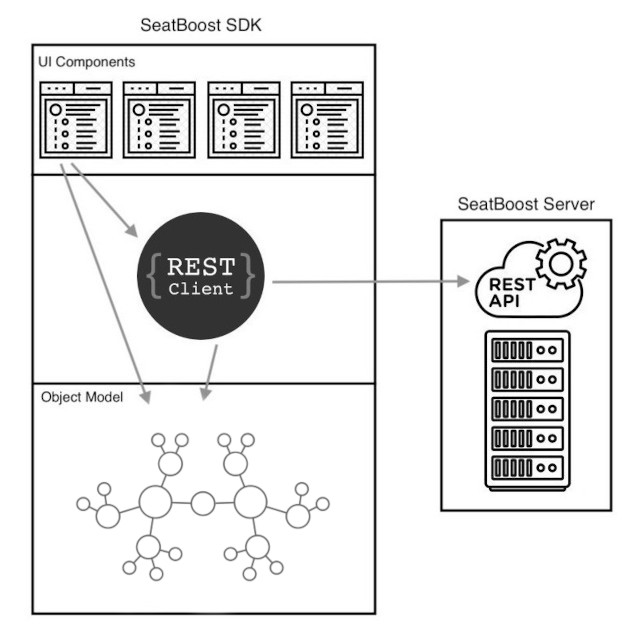

# Getting Started

The SeatBoost SDK has been meticulously engineered with the purpose of assisting your airline application in seamlessly integrating the functionality of flight upgrade auctions and replicating the exceptional user experience offered by the SeatBoost App.

### Installing

Please, contact SeatBoost support team to obtain the SDK binary version for integration into your application.

### Overview

The SDK is structured with three distinct layers, each serving a specific purpose and contributing to the overall functionality of the development kit. See the image below.

	

* **UI Components**: those elements are customizable screens provided by the SDK to embed the SeatBoost user experience into the airline application. Using UI components can significantly increase development speed by providing pre-built and reusable elements that developers can integrate into your application. 

* **REST Client**: this module was designed to facilitate the interaction between the client application and the SeatBoost RESTful web service.

* **Object Model**: those classes represent data for the SeatBoost application domain. They are used to map the structure of the data transmitted over the network (JSON) to a format that can be easily handled by the application using the SeatBoost SDK

If you prefer a more tailored approach, you have the flexibility to design and build custom screens entirely from the ground up. This involves bypassing the predefined UI components and opting to create interfaces that align precisely with your unique design requirements. Additionally, you can leverage the REST client functionality to establish direct communication with the server, granting you full control over data retrieval and exchange.

