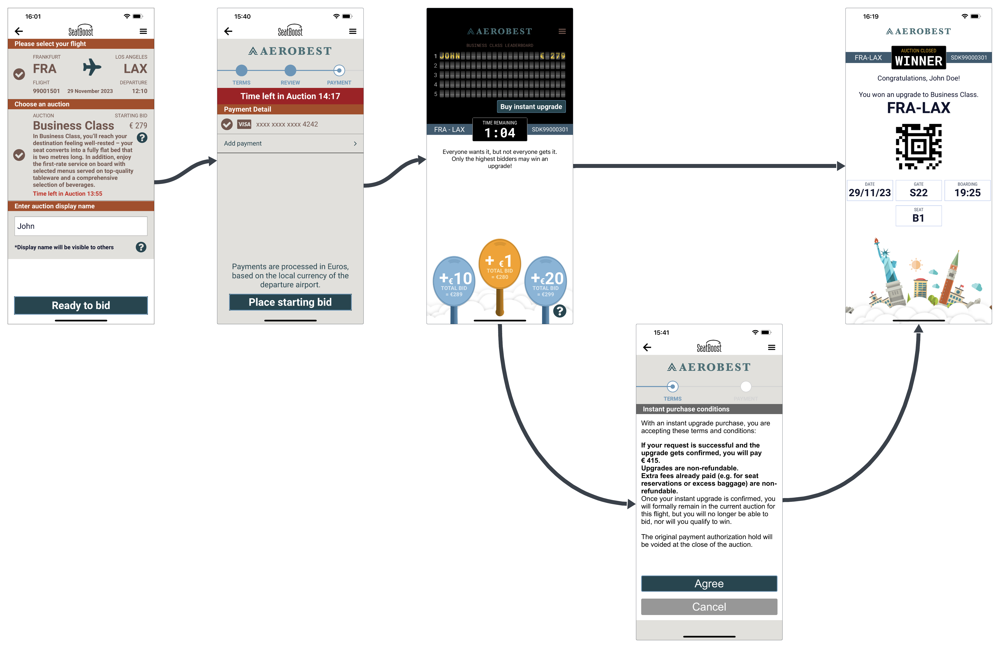

# SeatBoost User Interface Components

> The SeatBoost User Interface Components are the high level SDK tier. A user interface (UI) component is a modular and reusable element that is designed to perform a specific function or display specific information within a user interface.

> Some screens from the SeatBoost App were converted to UI components in order to be reused on the airline app. In the below image you can see the main flow of the SeatBoost App, each screen was encapsulates on a UI component, you can embed them in the airline app to get the SeatBoost auction functionality more quickly.

> The airline can, if necessary, creates similar user interface experience from scratch using the low level SeatBoost SDK: REST API bridge and object models.