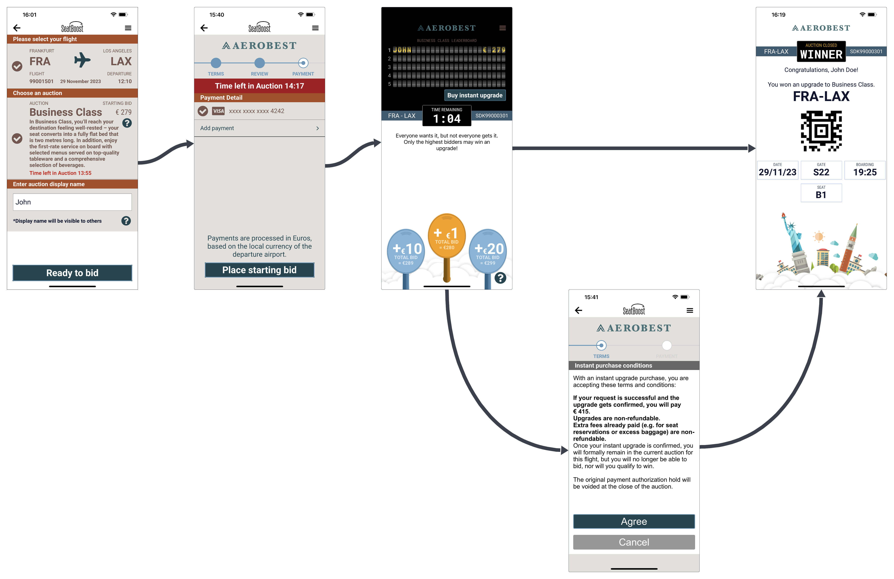

# Basic Flow Controller

> `SBBasicFlowController` is the hosted auction flow. Present it from your app after login (and after a PNR lookup or a history tap). It runs select upgrade, payment, live bidding, buy now, and end auction in a single `UINavigationController`.

Your app owns login, history, and PNR entry; the SDK owns the auction screens.



For a new lookup, call `findAuctions` and pass the result in `SBUpgradeContext`. See [Basic Integration](/examples-ios/basic-integration-ios.md).

## Creating the flow

Start from a PNR lookup by supplying an `SBUpgradeContext`:

```swift
let upgradeContext = SBUpgradeContext()
upgradeContext.selectedAirline = SBBootstrap.shared.getAirlineByCode(airlineCode)
upgradeContext.findAuctionResult = findAuctionResult
upgradeContext.username = lastUsedBidderName

let flow = SBBasicFlowController.create(upgradeContext: upgradeContext)
flow.basicFlowDelegate = self
flow.datasource = paymentDatasource
flow.modalPresentationStyle = .fullScreen
present(flow, animated: true)
```

Reopen an auction the user already joined (for example from history):

```swift
let flow = SBBasicFlowController.create(
    auctionToken: auctionToken,
    auction: auction,
    currentAvailableAuctions: availableAuctions
)
flow.basicFlowDelegate = self
flow.datasource = paymentDatasource
present(flow, animated: true)
```

| **Property Name** | **Type** | **Description** |
|-------------------|----------|-----------------|
| `basicFlowDelegate` | `SBBasicFlowControllerDelegate!` | Host callbacks for tokens, join, and close |
| `datasource` | `SBUnlockedPaymentCardDataSource!` | Saved payment methods for join / buy now |

`upgradeContext` must include at least `selectedAirline` and `findAuctionResult` when you use `create(upgradeContext:)`.

Subclass `SBUnlockedPaymentCardDataSource` (or implement `SBPaymentCardDataSource`) and persist `customerId` / `platformId`.

## SBBasicFlowControllerDelegate

```swift
public protocol SBBasicFlowControllerDelegate: AnyObject {
    func getTokenFor(auctionId: String) -> String
    func onJoin(auctionId: String, authToken: String, bidderName: String)
    func getLastUsedBidderName() -> String
    func onClose()
}
```

* **getTokenFor:** return the auction token you stored in `onJoin`.
* **onJoin:** persist the auction token and display name after a successful join.
* **getLastUsedBidderName:** pre-fill the display name on select upgrade.
* **onClose:** the user dismissed bidding with the close control.

Auction expired and participant-removed are handled inside the flow (it dismisses). They are not delegate methods. `onClose` may not run in those cases.
