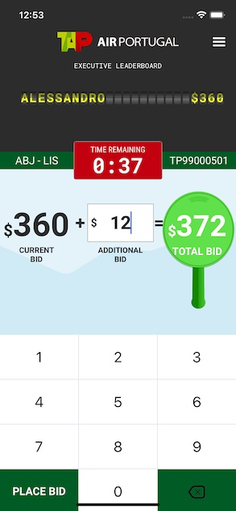

# Bidding

## SBBiddingController

> In order to use this UI component on your application you have to initialize it with some fields:

| **Property Name**   | **Type**                        | **Description**                                                       |
|---------------------|---------------------------------|-----------------------------------------------------------------------|
| isJoin              | `Bool`                          | A boolean informing if the auction instance was created from a join   |
| delegate            | `SBBiddingControllerDelegate!`  | The delegate instance used to receive the user interface events       |
| currentAuctionToken | `SBAuction?`                    | The auction used to play the bidding process                          |
| currentAuctionToken | `String`                        | The auction token used to play the bidding process                    |

## SBBiddingControllerDelegate

```swift
public protocol SBBiddingControllerDelegate: AnyObject {
    func onAuctionEnding()
    func onParticipantRemoved()
    func onEndAuction()
    func onBuyNow()
    func getConfettiParentView() -> UIView?
}
```




