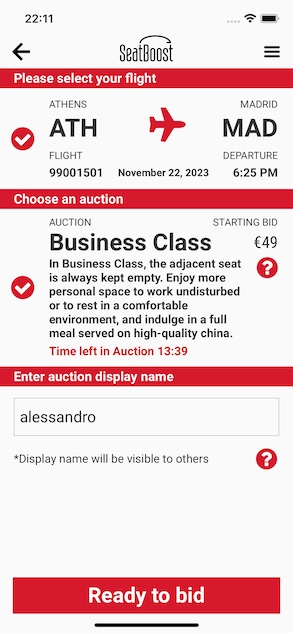
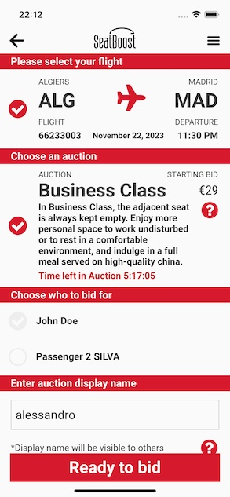

# Select Upgrade

> Please select your flight

Each row in the table represents a different flight. Information about the flights include the departure and arrival airports, departure date and time and flight number.

> Choose an auction

Each row in the table represents a different upgrade option. Information about the upgrades include the type of upgrade, additional services or amenities provided, the starting bid and the time left in the auction.

> Choose an auction

Users are asked to enter a name that will be used to identify their participation in the auction.

> In order to use this UI component on your application you have to initialize it with some fields: